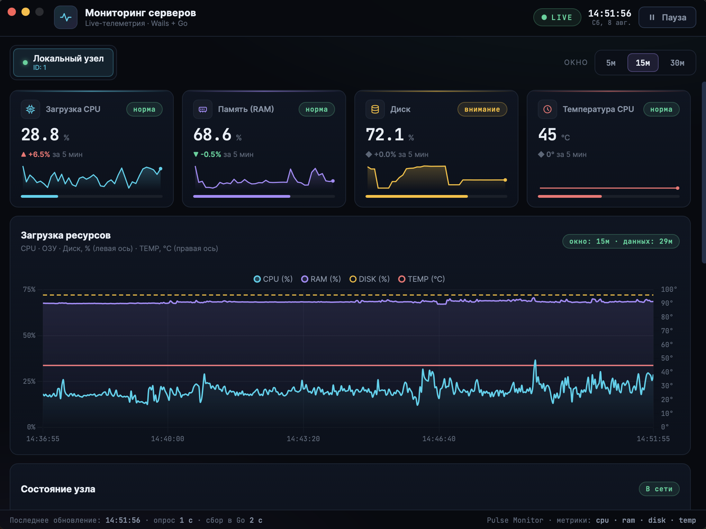

# Pulse Monitor

Pulse Monitor — десктопное приложение для мониторинга системных ресурсов macOS в реальном времени. Написано на Go с использованием фреймворка Wails и ванильного JavaScript для интерфейса.



## Возможности

- **Системные метрики:** отслеживание загрузки CPU, RAM, процентного заполнения диска и температуры с интервалом обновления в 1 секунду.
- **Нативный UX macOS:**
  - Окно со скрытой рамкой и сохранением системных кнопок.
  - Нативная область перетаскивания окна.
  - Работа в фоне: при нажатии на крестик окно скрывается, а процесс продолжается в Dock.
- **Буферизация:** хранение истории показателей для отрисовки плавных графиков без нагрузки на систему.

## Архитектура и стек

Приложение собрано в один компактный бинарник без использования внешних HTTP-серверов:

- **Backend (Go):** сбор показателей через `gopsutil`.
- **IPC (Wails):** прямой вызов Go-методов из JavaScript через биндинги в памяти.
- **Frontend (JS / HTML / CSS):** интерфейс без тяжелых фреймворков, визуализация графиков на Canvas с помощью `Chart.js`.

## Установка и запуск

### Скачать готовый релиз

1. Перейдите в раздел [Releases](../../releases).
2. Скачайте файл `Monitoring-v1.dmg`.
3. Откройте `.dmg` и перетащите `Monitoring` в папку `Applications`.

> **Внимание:** так как сборка не подписана сертификатом Apple Developer, при первом запуске используйте клик правой кнопкой мыши: **ПКМ -> Открыть**.

### Сборка из исходников

Для сборки требуются **Go 1.21+**, **Node.js** и установленный **Wails CLI** (`go install github.com/wailsapp/wails/v2/cmd/wails@latest`).

## Клонировать репозиторий
```bash
git clone https://github.com/Pilipchenok/monitoring-desktop.git
cd pulse-monitor
```

## Запуск в режиме разработки (Hot Reload)
```bash
wails dev
```

## Релизная сборка приложения для macOS
```bash
cd frontend && npm install && npm run build && cd ..
wails build -clean
```
